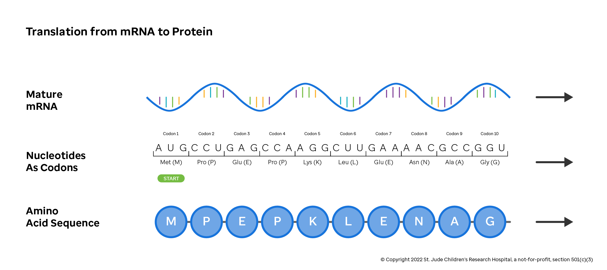
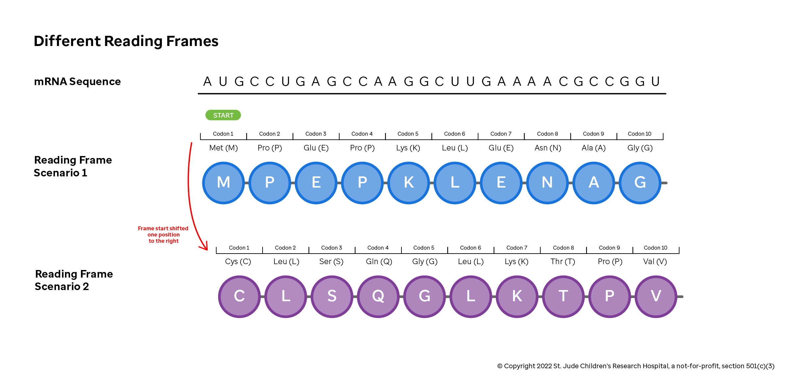

# Translation

## Decoding the Transcript

After DNA is transcribed to RNA and the RNA is spliced, the next step in protein
production is **translation**. The genetic code that cells use to translate RNA to protein
is universally preserved across organisms. So you, your dog, and the lettuce in your
salad all read and translate the genetic code the same. This helps scientists determine
which changes in a gene have functional consequences by comparing transcripts from
different species. Further, the universality of this code makes modeling genetic
diseases in animals—such as grafting cancer onto a mouse, known as a 
**xenograft**—informative.

:::info

As a short aside, DNA and RNA use different coding alphabets: in a mRNA
transcript, the DNA base thymine (T) is substituted by uracil (U). Thus, for all of the
figures referencing mRNA, we will use U in the place of T.
:::

The mRNA transcript is encoded in three-letter nucleotide blocks known as **codons**.
Codons specify that a particular protein building block, or **amino acid**, should be
added to a growing protein chain. For example, the mRNA sequence above has "CCU" in the
second codon position. This codon instructs the protein assembling machinery of the cell
to a Proline to the amino acid sequence at position two. 

As shown in the amino acid lookup table below, other codons specify that translation
should start or stop at a particular position. Further, multiple triplets translate to
the same amino acid, some changes to the nucleotide sequence may not change which amino
acid is added to the growing protein chain (e.g., if your triplet starts with "CG", the
amino acid is always an arginine and the third nucleotide doesn't matter).

This class of variation, where the mRNA sequence changes but the resulting protein
remains the same, is called a "silent mutation". There are many effects that changes in
the mRNA sequence can have on the final protein byproduct, ranging from insignificant to
deleterious. Knowledge of the codons and chemistry of proteins are used to predict
the effect of a given variant on the resulting protein.

## Reading Frames

Of course, any time you are decoding one alphabet into another, the accuracy of the
process depends on your starting in the correct location. The three-letter code, and
the resulting protein, will be completely different if translation starts on the first,
second or third nucleotide. 

Consider the sequence in the figure above (a contrived example, but useful for our
illustration here). If translation starts correctly at the first nucleotide, then the
translation machinery correctly reads a start codon ("AUG" or Methionine), and then reads the
following amino acids correctly. If the machinery were to start one nucleotide shifted
to the right, it would read "UGC" (resulting in a Cysteine) and then a completely
different protein would be made.

These different scenarios are referred to as **reading frames**, where the functional
or **open** reading frame is one that begins with the start codon "AUG" (resulting in
the Methionine). Changes to the sequence that starts, stops or moves a reading frame
dramatically alters the protein product. Mutations that change which
blocks of three nucleotides are used as codons are called **frameshift** mutations.
