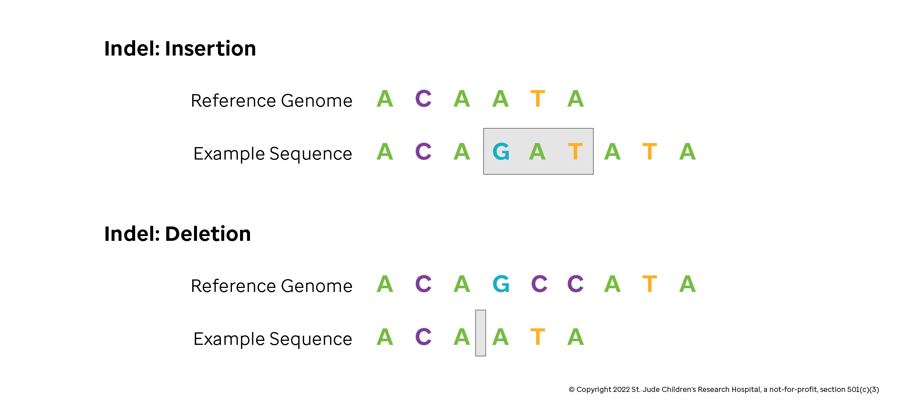

Insertions and Deletions are grouped together as a single class of events known
as "**[Indels](https://en.wikipedia.org/wiki/Indel)**." They are combined
because, when comparing different genomes, it is not possible to determine
whether one genome had an insertion or the other had a deletion. In these
events, at least one nucleotide is inserted into or deleted from the genome. For
example, assume the sequence "GAT" is inserted into the middle of a section of
the genome that normally reads "ACAATA", resulting in the sequence
"ACA**GAT**ATA".

As in the case with SNVs, many insertions and deletions may exist within a given
genome and discerning the significance of a given Indel will depend on its
location. Indels within coding regions of a gene may result in a frameshift such
that the entire protein is altered. Indels in non-coding regions range from
having no observable effect to influencing whether nearby genes are transcribed
at all.
